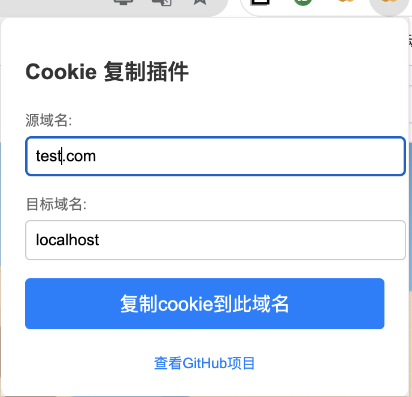

# Cookie 复制插件

复制cookie的Chrome扩展程序，允许用户从一个域名复制cookie到另一个域名。
主要是为了解决本地开发时 cookies 的问题，可以将测试环境的cookie 复制到 本地
也可以将本地环境的cookie复制到测试环境

## 功能

- 输入源域名和目标域名
- 将cookie从源域名复制到目标域名
- 记住用户设置的源域名默认值

## 安装

1. 克隆或下载此项目到本地：
    ```bash
    git clone https://github.com/zenglincient/copy-cookies-chrome-extension.git
    ```

2. 打开Chrome浏览器，访问 `chrome://extensions/`。

3. 开启右上角的“开发者模式”。

4. 点击“加载已解压的扩展程序”，选择下载的项目文件夹。

## 使用

1. 点击浏览器工具栏中的插件图标打开扩展程序。

2. 在弹出窗口中输入源域名和目标域名。

3. 点击“复制cookie到此域名”按钮。

## 文件

- `manifest.json` - Chrome扩展程序的配置文件
- `popup.html` - 扩展程序的弹出窗口页面
- `popup.js` - 处理弹出窗口逻辑的JavaScript文件
- `background.js` - 处理扩展程序后台逻辑的JavaScript文件
- `icon.png` - 扩展程序图标

## 示例

在弹出窗口中设置源域名和目标域名：



## 贡献

欢迎贡献！请 fork 此项目并提交 pull request。

## 许可证

MIT License
